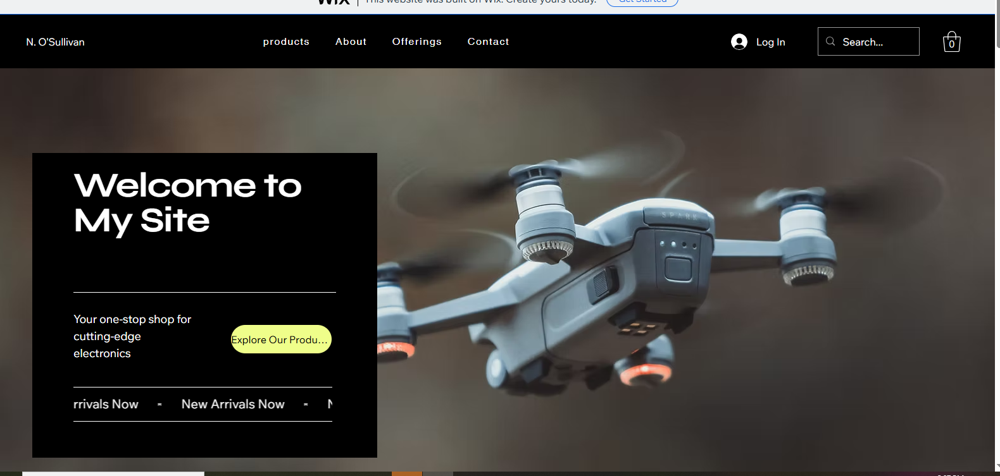
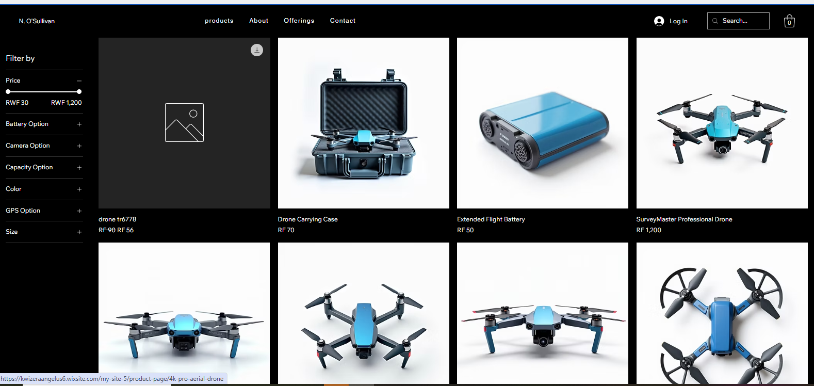
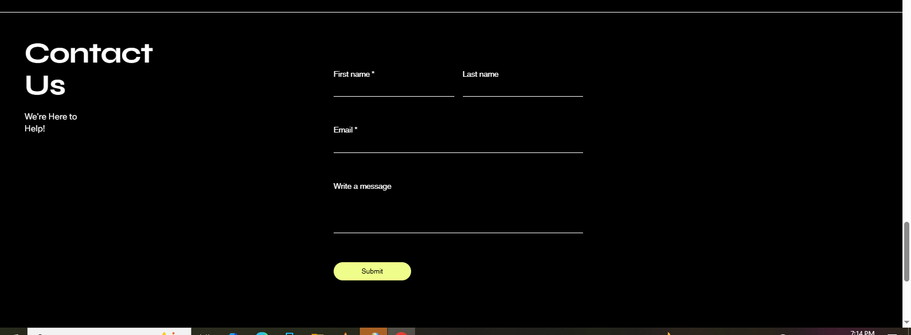

# Electeinic


# E-Commerce Website Project

## Student Information
- Name: Mbonyishema Olivier
- REGnumber:22744/2023
- Course: Software Engineering
- University: UNILAK

---

# Project Title
Smart Online Store Website

---

# Platform Used
This website was developed using Wix No-Code Platform.

Website Link:
https://kwizeraangelus6.wixsite.com/my-site-5

---

# Project Description
This project is a simple e-commerce website designed to allow users to view products, check prices, and interact with a shopping cart system. The website was created using a no-code platform to simplify development and improve user experience.

---

# Features Implemented
- Homepage with welcome message
- Product page with product images and prices
- About page
- Contact page
- Add-to-cart functionality
- Responsive website design
- Simple navigation system

---

# Pages Included

## Homepage
Contains:
- Store name
- Welcome message
- Featured products

## Product Page
Contains:
- Product images
- Product prices
- Product descriptions

## About Page
Contains:
- Store information
- Mission and objectives

## Contact Page
Contains:
- Email address
- Phone number
- Contact form

---

# Tools and Technologies Used
- Wix
- GitHub
- Markdown (README.md)

---

# Screenshots

## Homepage




## Product Page


## Contact/Cart Page


---

# Challenges Faced
- Organizing product layouts
- Designing responsive pages
- Managing navigation between pages

---

# Lessons Learned
- How to build a website using Wix
- How to use GitHub repository
- How to write documentation using Markdown
- Importance of UI/UX design

---

# Live Website Link
https://kwizeraangelus6.wixsite.com/my-site-5

---

# GitHub Repository Link
https://github.com/mbonyishemaolivier-eng/Electeinic/

---

# Conclusion
This project helped me understand how no-code platforms can be used to create professional e-commerce websites quickly and efficiently.
```0
